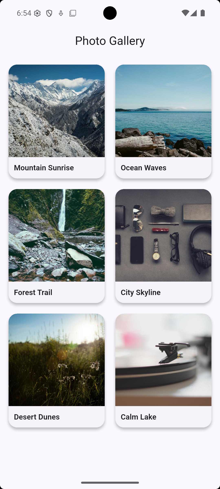

# Hero Widget Demo – Photo Gallery

A Flutter demo app showcasing the **Hero** widget through a realistic photo gallery use case.

## Screenshot

## Instructions

git clone https://github.com/henryparfait/hero_demo_app.git

cd hero_demo_app

flutter pub get

flutter run

> Requires Flutter 3.x+ and an emulator or connected device.

## Three Attributes

| # | Property | What It Does | Why a Developer Would Use It |
|---|----------|-------------|------------------------------|
| 1 | **`tag`** | A unique identifier that links the Hero on the source page to the matching Hero on the destination page. | Without matching tags, Flutter cannot know which widgets to animate between routes. Each item needs its own unique tag. |
| 2 | **`flightShuttleBuilder`** | Customises what the widget looks like *during* the flight animation. Here it morphs rounded corners to square. | The default flight can look rough when shapes differ. This builder creates polished, app-store-quality transitions. |
| 3 | **`transitionOnUserGestures`** | When `true`, the Hero animation plays during swipe-back gestures, not only on programmatic `Navigator.pop()`. | Real users swipe back instead of tapping the back button. Without this, the hero snaps instead of animating. |

                                                 Thank You
